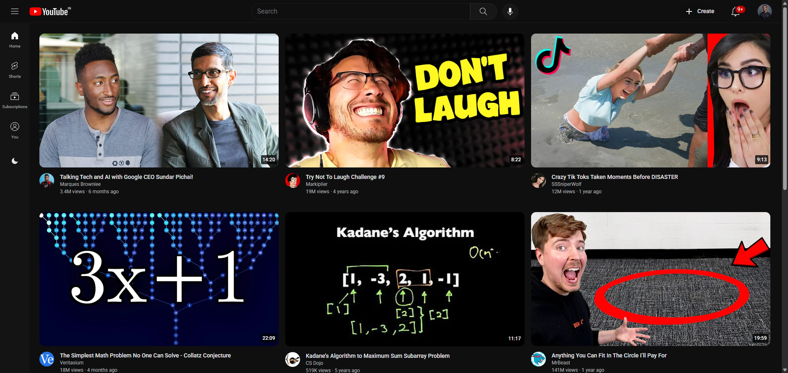

# YouTube Landing Page Clone

A high-fidelity, responsive recreation of the YouTube homepage. This project demonstrates advanced layout techniques using modern CSS and interactive UI states with JavaScript, featuring a fully functional Dark Mode toggle.

### Live Demo  
https://athulnath03.github.io/youtube-landing-page/

---

## Project Preview



---

## Key Features

- **Dynamic Theme Switching** — Toggle between light and dark modes using CSS Variables and JavaScript.
- **Responsive Grid System** — Layout adapts from 4 columns (desktop) to 1 column (mobile) using CSS Grid and Media Queries.
- **Modular CSS Architecture** — Styles separated into dedicated files for scalability and maintainability.
- **Interactive UI Elements** — Hover effects, styled tooltips, and collapsible sidebar.
- **SVG Icons** — Lightweight, scalable vector graphics for crisp visuals.

---

## Project Structure

```
youtube-landing-page/
│
├── index.html              # Main entry point (GitHub Pages deployment)
├── script.js               # JavaScript for theme switching and UI interactions
│
├── assets/
│   ├── css/
│   │   ├── general.css     # Global variables & theme configuration
│   │   ├── header.css      # Header and search bar styling
│   │   ├── navbar.css      # Navigation bar styling
│   │   └── sidebar.css     # Sidebar layout and toggle behavior
│   ├── Icons/              # SVG icons and related assets
│   ├── profile pictures/   # User profile images
│   └── thumbnails/         # Video thumbnail images
│
└── README.md               # Project documentation
```
---

## Tech Stack

- **HTML5**
- **CSS3**
  - CSS Grid
  - Flexbox
  - Media Queries
  - CSS Custom Properties (Variables)
- **JavaScript (ES6)** — DOM manipulation for theme switching

---

## Run Locally

1. Clone the repository:
   ```bash
   git clone https://github.com/athulnath03/youtube-landing-page.git

Open the folder.

Double-click index.html
or use a Live Server extension in VS Code.

## Deployment

Hosted using GitHub Pages
Live URL:
https://athulnath03.github.io/youtube-landing-page/

## Author

Athul Nath M

GitHub: https://github.com/athulnath03

## Support

If you like this project, consider giving it a ⭐ on GitHub!


